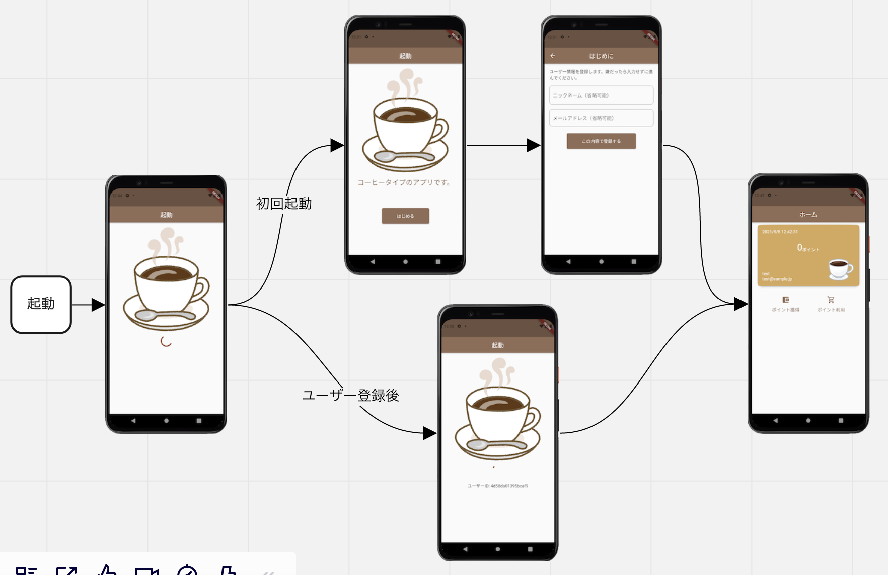
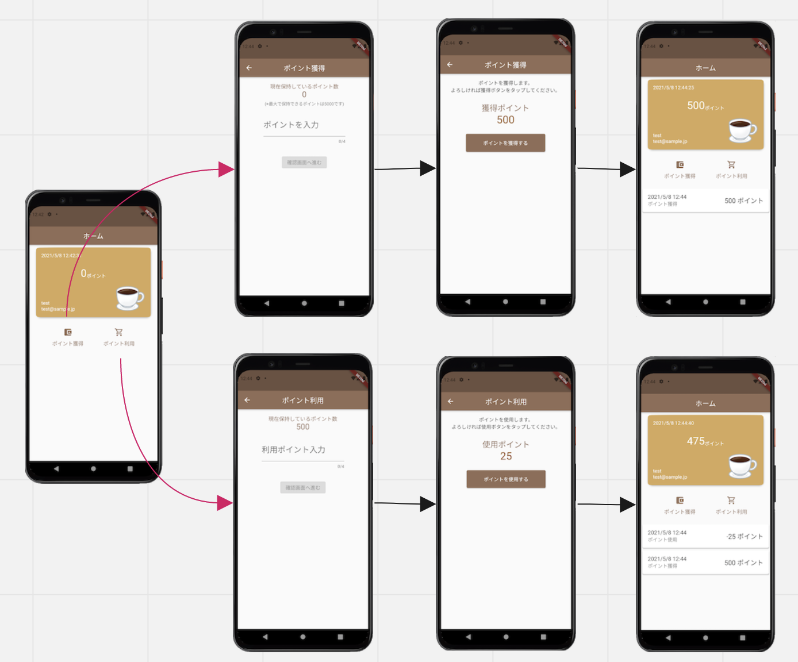

# mybt
Flutterでアプリを作成する際の設計を検討するアプリです。  
設計検討が目的なのでこのアプリ自体は機能が不十分だったり不足があります。例えば初回起動時に登録したニックネームやメアドを編集する画面がなかったりポイントの利用履歴がホーム画面に表示されています。  
アプリ名のmybtは「my brue print test app」からとったものです。  
単純に頭文字のmbptaだと微妙なのでいろいろ考えてmybtとしましたが、今考えるとそもそも元となった英文が微妙でした。

# アプリ概要
miroで作成した画面フローのスクリーンショット  
  

# 設計概要
View, ViewModel, Repositoryの3層構成にしています。  
- ViewModel
  - `StateNotifierProvder`で実装しています。1つの業務フロー（ポイント獲得やポイント利用といった単位）で1つのViewModelを作り、フロー終了とともにautoDisposeで破棄されるようにしています。
- Model
  - アプリ全体を通して使うものは`StateNotifierProvider`で実装するようにしており、それ以外は通常のクラスとなります。
- Repository
  - 通常のクラスで実装し`Provider`でアクセスします。配下のlocalパッケージとremoteパッケージのクラスも同じです。
  - LocalDBはHiveを使用しRemote通信はdioを使用しています。ただ、実際のAPI通信は行わずDioClientはfake実装しています。
  - LocalDBで使うEntityやRemoteのResponseはアプリ内で主にデータのやり取りをするModelクラスとは別にし、Mapperなどを通してアプリで使いやすい形にしています。（特にAPIの仕様変更時にモデルクラスの影響を極力少なくするためです。）

# ViewModelについて
~~`StateNotifier`を使っていないのは画面に複数の状態を持ち、かつ入力値をmutableで持っても良いかなと思ったため。~~   
→~~(2022年4月追記)入力値は全てStateProviderで持った方が良いと思っているのでリファクタリングで修正しています。~~  
→なんでもStateProviderにするのは良くなさそうだったので再び修正しています。

カウンターアプリなど単純な状態管理なら`StateProvider`で良いのですが、商用プロダクトでは色々な入力フィールドが相互に絡み合うようなケースが多いです。  
単に複数の状態を持つならUIModelのような画面データを集約したモデルクラスを作って`StateNotifier`でやりとりすれば良いのですが、頻繁に変更される入力フィールドやチェックボックスが多くある場合、StateNotifierにしてしまうとこんな設計になってしまうと思います。
  1. `StateNotifier`のStateに画面の初期ロードデータを持ち、フィールドに入力データをもつ（mutableとimmutableの混在）
  2. mutableとimmutableを分けてStateに全て持つ

自分は`StateNotifier`を使うなら2を採用しますが、これで実装してみたらcopyWithメソッドの嵐になったのでちょっと立ち止まって検討することにしました。  
→(2022年4月追記) この方法は[AndroidDeveloperサイトのUILayer](https://developer.android.com/jetpack/guide/ui-layer)にも記載されたとおりUIStateとして定義されました。アリな設計かなと思います。  
→(2022年5月追記) この方法で書き換えました。

全画面が複雑なデータを持っているわけはなく（そういうアプリは多分UIを再検討すべき）ほとんどが簡易な画面なので、ならばViewModelによって`ChangeNotifierProvider`と`StateNotifierProvider`を分けるという選択肢もどうかなと思いました。  
しかし、この2つは結構使い勝手が違うので統一感がなくなって実装者が混乱してしまうと思い、じゃあどちらかに統一するならmutableを許容して`ChangeNotifierProvider`で行こうと考えました。  
→(2022年4月追記) この方法はViewへの反映方法にいちいち`notifyListeners`を使うことになり、Pageのルートで`uiState`をwatchしているためパフォーマンス的に非常に良くない設計になってしまいます。そのため最近は画面で扱うデータは`StateProvider`か`StateNotiferProvider`を使うようにしています。  
ただ、どうしても複雑な画面になると`StateProvider`の数が膨大になるので`UiState`を再度検討してもよいのかなと思いました。  
現状では、基本的にフローへ入った際の起動時UI状態を管理するだけとしそれ以外では`notifyListeners`は使わないようにし、`ViewModel`はロジックのみ持つようにしています。  
ただこれも小規模アプリだからであって、複雑なアプリになると他の画面から渡ってくるデータをもとに画面起動時に色々処理をして画面表示するケースもよくあるので、そういった場合のデータの持ち方は現在も模索中です。個人的には他画面から引き継ぐデータはimmutableな値であるためフィールドで持ってもいいのかなと思っています。  
また、もはや今の`ViewModel`は`ChangeNotifierProvider`で実装している意味ないので`AsyncValue`の方がいい気がしています。  
→(2022年5月追記) `ChangeNotifierProvider`は全て廃止して`AsyncValue`で修正してみました。  

# 各画面のUIステータス
その業務フローに入るメインの画面は必ずViewModelを持つようにしました。  
（業務フローに入るメインの画面、というのは例えばAndroidでActivity＋複数Fragmentで画面フローを作る場合のActivityのこと）  

~~BaseViewModelは`OnLoading, OnSuccess, OnError`の3つの状態をもち、View側でこれらの状態に応じたWidgetを生成します。~~  
~~初期状態は`OnLoading`になっているので、ViewModelは必ずinit処理を実装し`OnSuccess`か`OnError`に状態をうつします。~~  
~~ただ、この実装はとてもモヤモヤしている。~~  
~~freezedで状態クラスを生成しているから作成自体は楽だが、状態の変更に`notifyListeners()`を呼ぶ必要があるので忘れないよう`BaseViewModel`で各状態へ遷移するメソッドを用意している。~~  
~~protectedスコープがないため、Viewからもこれらのメソッドを呼べてしまうしViewModelの処理内でもstateが見えてしまう。書き換えは出来ないのだが可読性が下がる様な気がしなくもない。悪あがきで`state`という変数名はやめてuiをつけている。~~  
~~また、これらは画面起動時にしか呼ばず、メインの処理を実行する際はユーザーが画面に何らかのインプットをした後なので、これらの状態を使ってしまうとWidgetの再描画が行われて変な感じになる。（ProgressDialogの様なものを表示して画面は見えていた方がいいと思う）~~  
~~そう考えると`FutureBuilder`の方が良いのか、もしくは`ChangeNotifierProvider`から見直す必要があるが`AsyncValue`を使った方がいいのか・・~~  
→(2022年4月追記) ここはラスト1文に記載している通り`AsyncValue`でいいかなと思っています。まだコードには反映していないので本当に良いか未検証ですが。
→(2022年5月追記) `AsyncValue`にしました。

# その他
## import文について
EffectiveDartには相対パスが望ましいかもと記載があるが強く推奨しているわけではないようです。  
個人的に相対パスは紛らわしいことと、拡張機能で自動importするとpackage記載になるので一貫性を保つため全てpackage記載にしています。  
参考: https://stackoverflow.com/questions/59693195/flutter-imports-relative-path-or-package  
## ローカル変数について
どれにするか迷った。
1. final [型] argName;
2. [型] argName;
3. var argName;
4. final argName;

本当は1がいいと思いますが、長いので右辺で型が明確な場合はせっかく推論機能もあるし3か4が良いと思っています。  
kotlinのvalが採用されていれば迷いなく1でしたが、ローカルかつスコープが短ければ可読性に全振りして3でも良いのかなと思いました。
ただ、個人的にいつもの癖があるのでこのアプリでは4で行くことにします。（型が完全に不明で可読性に問題があると判断した場合は1も使います）

## 自動生成クラス
freezedやhive, mockitoのテストクラス自動生成のため、最初の1回は必ずrunnerのbuildコマンドを実行します。  
このリポジトリの大きさでも微妙に時間がかかっているのでプロダクトだと工夫しないと辛そうだなと思いました。
そもそも自動生成はAndroidのdatabindingのように別ディレクトリに生成されると良いのですが・・
`pub run build_runner build`

## flutter_flavorizr
Flavorの検証もしたかったので`flutter_flavorizr`ライブラリを使ってコーヒーアプリ環境と紅茶アプリ環境をそれぞれ作成しています。
実行コマンドはそれぞれ以下の通りです。
- flutter run --flavor coffee -t lib/main_coffee.dart
- flutter run --flavor tea -t lib/main_tea.dart

## テストについて
このリポジトリではサンプルしかありませんが、本当はViewModel/Repositoryパッケージ/Modelパッケージでビジネスロジックを持っているクラスは全部テスト書いた方が良いと思います。  
RepositoryクラスでAPI経由で取得したデータをそのまま返すメソッドとか、ViewModelでRepositoryのメソッドを実行するだけとかそういうメソッドはテスト不要だと思います。  
（前者はAPIクラスがあるはずなのでそのテストを、後者はRepositoryの該当メソッドをテストすれば良いので。）  
ただ、その後の機能追加/改修案件をやるときに既存のメソッドに変なコードを追加していないか検証する目的なら全てのメソッドのテストを書いた方が安心感が増します。  
どこまで書くかはコストとスケジュール次第なのでプロジェクトによって相談だと思います。  
あと、WidgetテストとIntegrationテストはどこまで実装するのがいいかは未解決です。特にWidgetテストで、まだ自分が有用性を見出せていないので要学習。  

## パフォーマンス測定
私はvscodeで開発しているため、profileでビルドし`Dart DevTools`を使ってパフォーマンスモニターをしています。  
`flutter run --flavor coffee -t lib/main_coffee.dart --profile --cache-sksl --purge-persistent-cache`